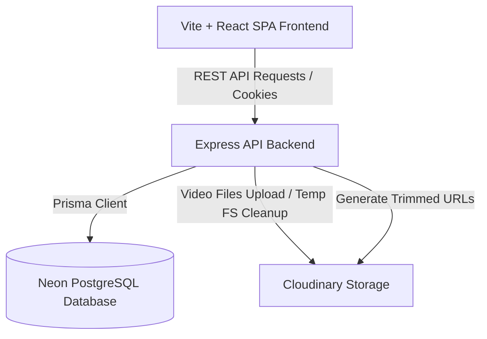

# Mixeo 🎬

Mixeo is a modern video editing and sharing web application. It allows users to register accounts, sign in, upload video assets, select precise trim ranges using an interactive timeline slider, and stage video clips.

---

## 🏗️ Architecture & System Design

Mixeo is designed as a secure, fast, and scalable monorepo divided into two distinct workspaces:



### 1. Frontend (`frontend/` workspace)
- Built with **React 19** and **Vite 8** as a single-page application (SPA).
- Uses **React Router 7** for secure client-side routing.
- Implements an interactive video range editor component leveraging **`rc-slider`** for precise millisecond-level start and end offset selection.

### 2. Backend (`backend/` workspace)
- An **Express.js** REST server that listens on port `3000`.
- Configured with session storage (`express-session` + `connect-pg-simple`) to store authenticated sessions inside a Postgres table rather than memory.
- Uses **Multer** to parse incoming multipart video uploads and save them temporarily on disk before streaming them directly to cloud storage.

### 3. Database & ORM
- Uses **Prisma ORM** for type-safe database queries.
- Connects to a serverless **Neon PostgreSQL** database.
- Database Schema models:
  - `User`: Handles email/password authentication records (passwords hashed using `bcrypt` with 12 salt rounds).
  - `Video`: Tracks uploaded source videos, including their Cloudinary ID, duration, and secure URL.
  - `Clip`: Tracks trimmed segments created from source videos.

### 4. Asset Storage & Video Trimming
- **Cloudinary** is used for secure video hosting and asset delivery.
- **IMPORTANT**: Mixeo does **NOT** require local server-side `ffmpeg` installations. Video trimming and staging operations are offloaded entirely to **Cloudinary on-the-fly URL-based video transformations** (`cloudinary.url(...)` with `start_offset` and `end_offset` parameters).

---

## 📂 Project Directory Structure

```
Mixeo/
├── backend/                  # Express API Server
│   ├── lib/                  # Library Singletons (Prisma Client in db.js)
│   ├── middleware/           # Upload (multer) and Auth (session validation)
│   ├── prisma/               # Schema configuration and database migrations
│   ├── routes/               # Routes for authentication and media manipulation
│   └── server.js             # Main server entrypoint
│
├── frontend/                 # React SPA Client
│   ├── src/
│   │   ├── components/       # Layout, Navbar, ProtectedRoute, RangePlayer
│   │   ├── context/          # AuthContext for session management
│   │   ├── pages/            # Page templates (Home, Editor, Preview, Auth)
│   │   ├── services/         # Client API functions (fetch requests)
│   │   └── main.jsx          # React app DOM mount point
│   ├── vite.config.js        # Vite compilation configuration
│   └── index.html            # Main HTML wrapper
│
├── meta/                     # Release plans, planning logs, and issues
└── package.json              # Monorepo workspaces configuration
```

---

## 🔧 Environment Setup

To run this application locally, you must configure a `.env` file in the root directory. Create a new `.env` file at the project root with the following structure:

```env
# Cloudinary configuration (API key and cloud name)
CLOUDINARY_URL=cloudinary://<api_key>:<api_secret>@<cloud_name>

# Session encryption (any long random secure string)
SESSION_SECRET="your-session-encryption-secret"

# Neon PostgreSQL Database URL
DATABASE_URL="postgresql://<user>:<password>@<neon-host>/neondb?sslmode=require"
```

---

## 🚀 Installation & Running Locally

Follow these steps to set up and start the application in development mode:

### 1. Clone & Install Dependencies
Run the workspace-aware install command from the root directory to install and link all frontend, backend, and root workspace packages:
```bash
npm run install:all
```

### 2. Apply Database Migrations
Run the database migration command to set up the Postgres tables (`users`, `videos`, `clips`, `session`) on your Neon instance:
```bash
npx prisma migrate dev --schema=backend/prisma/schema.prisma
```

### 3. Launch Development Server
Start both the Vite frontend server and Express API server concurrently:
```bash
npm run dev
```
- The React Frontend will be available at: `http://localhost:5173`
- The Express Backend API will run on: `http://localhost:3000`

### 4. Build for Production
To bundle the frontend for static serving by the backend:
```bash
npm run build
```
In production mode, the Express server automatically serves the compiled static files from the `frontend/dist` directory.
